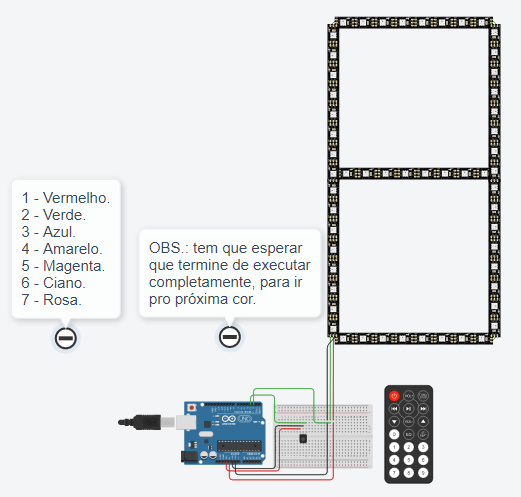

# Desafio 3 (**Arduino Uno**)
### **Curso de Extensão (IFAL/Maceió - 2021)**: Computação Embarcada com Arduino Uno e ESP8266.
 

**Complemento**:
* [Desafio 2 (Arduino Uno).](https://github.com/Nicolas-albu/desafio_2_arduino)

**Componentes**:
| Nome | Quantidade | Componente |
| ---- | ---------- | ---------- |
| U1   | 1          | Arduino Uno R3 |
| U3   | 1          | Sensor de Infravermelho |
| LED1, LED2, LED3, LED4, LED5, LED6, LED7 | 7          | Faixa de NeoPixel 8 |

- **Como Funciona?**
    Definimos o pin do sensor infravermelho e chamamos para definir a variável **irrecv** do tipo *IRrecv*.
    ```cpp
    IRrecv irrecv(RECV_PIN); // Sensor Infravermelho
    decode_results results; // Passa os resultados decodificados
    ```
    Permitimos o irrecv de receber informações pelo Sensor infravermelho.
    ```cpp
    void setup()
    {
        irrecv.enableIRIn();
    }
    ```
    No **loop()** teremos que colocar uma condição para verificar se as informações decodificadas do *results* podem ser interpretadas.
    ```cpp
    if(irrecv.decode(&results))
    {
        unsigned int value = results.value; // Guardar os valores dos botões recebidos.
        ...
    }
    ```
    Depois é só criar um Switch/Case com os valores dos botões e adicionar o *for* para preencher todos os LEDS dos NeoPixels.

    Separei os códigos dos botões de 1 à 7, e o código RGB utilizado por cada botão.
    ```cpp
    1 -> 2295; Vermelho -> RGB(255,0,0)
    2 -> 34935; Verde -> RGB(0,255,0)
    3 -> 18615; Azul -> RGB(0,0,255)
    4 -> 10455; Amarelo -> RGB(255,255,0)
    5 -> 43095; Magenta -> RGB(255,0,255)
    6 -> 26775; Ciano -> RGB(0,255,255)
    7 -> 6375; Rosa -> RGB(217,134,149)
    ```